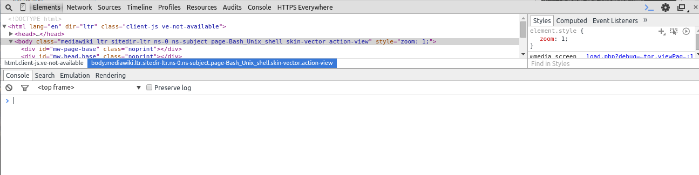

# The Coder’s Toolbelt

Good Programmers are lazy. They let their computer do the tedious tasks so that they can focus on the fun aspects of programming. Developers love writing tools for themselves. Often times, this code becomes useful enough for developers to release their code to other developers for their use.

Having a good understanding of the various tools developers use to code is a large part of being a successful programmer.

Below I list the main parts of a developer's toolbelt and link to open-source (free) resources for each part of the toolbelt.

## The Text Editor

Code Text editors simply edit characters as is, they don't do word formatting. Unlike Word Processors they are not made for printing or publishing text.

There are many, many different text editors out there. For beginners I would recommend downloading [atom.io](https://atom.io/), which is an open-source multi-platform text editor written by the github development team.

*When coding or thinking about software, remember one thing:* **Code is just words.**

### Setting Up Your Text Editor

Customizing your text editor will go a long way towards improving your dev experience. Things you'll want to ensure your editor is configured with are:

* **Syntax Highlighting** I recommend the [solarized](http://ethanschoonover.com/solarized) pallete, but this is a matter of personal taste.
* **Font style and size** You will need to use a `fixed-width` font when developing. Serif or Sans-Serif styles have differing character widths which make it hard to read code. I recommend the [Anonymous Pro](http://www.marksimonson.com/fonts/view/anonymous-pro) font style. It has been carefully crafted to differentiate special characters and is an open-source font.
* **Project management & Tabs** Keeping your code organized is very important. Like a tabbed browser, atom.io provides tab support and a file pane to explore a project folder.
* **Plugins** The ability to extend your text editor is also important. In atom.io you can install packages via the atom.io package manager.

## The Command Line

Have you ever wanted to talk directly to your computer without clicking over and over? The command line lets you directly communicate with your computer. Depending on your operating system (OS), you'll have different command lines available to you.

The full power of the command line is beyond the scope of this talk, but definitely experiment with some command line programs:

* Windows: [PowerShell](https://en.wikipedia.org/wiki/Windows_PowerShell) seems to be the new go-to for scripting. I haven't personally dabbled in it.
* Mac OSX: [iTerm 2](https://www.iterm2.com/) is a drop-in replacement for the limited Mac OSX command line.
* Linux: the default command line, [Bash](https://en.wikipedia.org/wiki/Bash_(Unix_shell)), is awesome. It is the language most modern command line tools try to emulate.

For the most part, I will use the terms `shell` and `command line` inter-changibly.

## The Browser

Back in the olden days of the internet, it used to be that everything was text-based and very limited in terms of graphics.

For some nostalgia, you can try this command in your shell:
`telnet towel.blinkenlights.nl`

As computers evolved, so too did the way we interact with them. The World Wide Web is an extension of an already existing Internet. Remember, **code is just words.**

If you're ever curious about how some website was written, just hit Control+U in your browser.

### Advanced Browsering

In Chrome and Firefox, you can open a development tools panel with a special key command (Chrome = F12):

## Google-Fu and Documentation

It's no surprise that developers love the Internet. When you are working with a new code library, you should always have a copy of its documentation handy on a separate tab.

## Git & Version Control

A key part of keeping your code organized is the ability to hit "undo" to try something else. A good editor will almost always have an "undo" function. Sometimes, however, undo isn't enough. That's where version control comes in.

A Version Control System (VCS) allows you to revert changes and "rewind" your code to the last state you put it in. It also lets you "clone" someone else's code for your editing pleasure. Git is the de-facto open source standard for sharing code. GitHub is the defacto remote repository for hosting your git code to the public.

For our purposes, unless you're more comfortable with using the command line (or are using linux), we will be using github and its graphical interface:

* [Mac OSX](https://mac.github.com/)
* [Windows](https://windows.github.com/)

Be advised, GitHub will be releasing a unified [desktop app](https://windows.github.com/) in the near future.

You will need to create a github user account.

Folow [Github's Guide](https://guides.github.com/introduction/getting-your-project-on-github/) for more information.

## The Programmer's Loop

The key to successful development is having your environment set up in such a way as to be able to fail rapidly &amp; safely. As soon as you make a change to your code, you should be able to see its effects right away. If something breaks, you should be able to compare your changes to see what you changed that broke the code.

### Steps to Bug Fixing

When you inevitably run into a bug in your code, do the following:

1. Take a deep breath. Stuff happens.
2. Ensure you have a testing loop set up (see above).
3. Undo what you just did and try running the code again.
4. If that doesn't work, use git's diffing tools to see if other things have changed.
5. If that still doesn't work, or if the issue is deeper than you thought, step away from the desk. Seriously, if you keep code in your head, you'll focus on the wrong parts of what's causing the breakage.

## [Python!](README_python.md)
